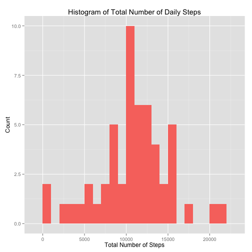
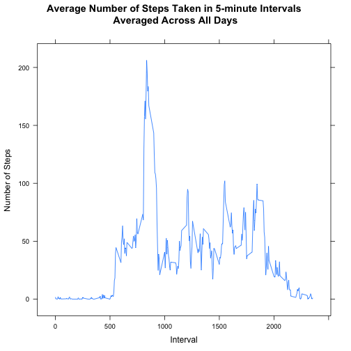
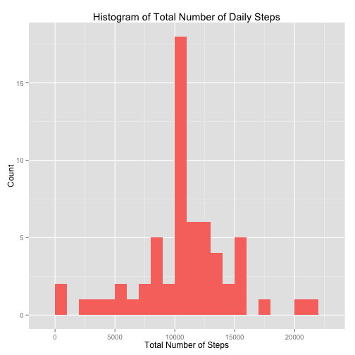
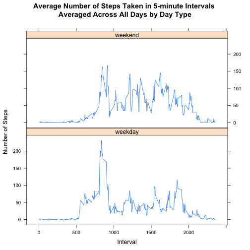

## Loading and preprocessing the data

Let's start by reading the data first.  
The raw data file activity.csv should be in your working directory.


```r
thedata<-read.csv("activity.csv")
```

Then I'll convert the date column into a variable of type date

```r
thedata$date<-as.Date(thedata$date,format="%Y-%m-%d")
```

## What is mean total number of steps taken per day?

####Q1 Calculate the total number of steps taken per day

Here I'll calculate the total number of steps taken per day


```r
daysum<-aggregate(steps ~ date, data=thedata, FUN=sum)
```

#### Q2 Make a histogram of the total number of steps taken each day


```r
library(ggplot2)
plot1<-qplot(date, data=daysum, geom="bar", binwidth = 1,
      weight=steps, fill="red", main="Total Number of Steps by Date",
      xlab="Date", ylab = "Total Number os Steps")
plot1<-plot1+theme(legend.position = "none")
print(plot1)
```

 

#### Q3 Calculate and report the mean and median of the total number of steps taken per day


```r
datamean<-mean(daysum$steps) ## Calculates the Mean
datamedian<-median(daysum$steps) ## Calculates the Median
```

- The mean total number of steps taken per day is **10766.19**.  
- The median total number of steps taken per day is **10765**.

## What is the average daily activity pattern?

#### Q1 Make a time series plot (i.e. type = "l") of the 5-minute interval (x-axis) and the average number of steps taken, averaged across all days (y-axis)

Here I'll calculate the mean of steps by interval and plot it.


```r
intervalmeans<-aggregate(steps ~ interval, data=thedata, FUN=mean) ## Calculating Mean of Steps by Interval
library(lattice)
plot2<-xyplot (steps ~ interval, data=intervalmeans, type="l",
               main="Average Number of Steps Taken in 5-minute Intervals \nAveraged Across All Days",
               xlab="Interval", ylab="Number of Steps")
print(plot2)
```

 


#### Q2 Which 5-minute interval, on average across all the days in the dataset, contains the maximum number of steps?

To find out the 5 minute interval with the maximum number of steps on average across all days I'll use the below code.


```r
highestinterval<-intervalmeans[which.max(intervalmeans$steps),1] ## Gives the Interval with the highest Avg Number of Steps
highestnumsteps<-intervalmeans[which.max(intervalmeans$steps),2] ## Gives the Highest Average Number of Steps in a 5-minute Interval
```

The interval with the maximum number of steps on average across all days was **835** and the average number of steps in that interval was about **206.17**.

## Imputing missing values

#### Q1 Calculate and report the total number of missing values in the dataset (i.e. the total number of rows with NAs)

I'll start by calculating the total number of missing values in the dataset (i.e. the total number of rows with NAs)


```r
missingvalues<-sum(is.na(thedata$steps))
```
The total number of missing values in the dataset is **2304**.

#### Q2 Devise a strategy for filling in all of the missing values in the dataset. The strategy does not need to be sophisticated. For example, you could use the mean/median for that day, or the mean for that 5-minute interval, etc.

After looking at the data, I have decided to take the mean for a 5 minute interval to fill in the Missing Values in that 5 minute interval. That I think, would give a fair estimate of what the data would have looked like had it not been missing.

#### Q3 Create a new dataset that is equal to the original dataset but with the missing data filled in.

Below I create a new dataset that is equal to the original dataset but I use the interval means data generated earlier to fill in the missing values based on those interval means.


```r
imputeddata<-thedata
for (i in 1:nrow(imputeddata)){
        if (is.na(imputeddata[i,1])){
                imputeddata[i,1]<-intervalmeans$steps[which(intervalmeans$interval==imputeddata[i,3])]
        }
}
```

#### Q4 Make a histogram of the total number of steps taken each day and Calculate and report the mean and median total number of steps taken per day. Do these values differ from the estimates from the first part of the assignment? What is the impact of imputing missing data on the estimates of the total daily number of steps?

Let me start by drawing a histogram of the total number of steps taken each day after imputing the missing values.


```r
impdaysum<-aggregate(steps ~ date, data=imputeddata, FUN=sum) ## Calculating the sum of steps by date
plot3<-qplot(date, data=impdaysum, geom="bar", binwidth = 1,
      weight=steps, fill="red", main="Total Number of Steps by Date",
      xlab="Date", ylab = "Total Number os Steps")
plot3<-plot3+theme(legend.position = "none")
print(plot3)
```

 

Now I'll calculate the mean and median total number of steps taken per day after imputing the missing values.


```r
impdatamean<-mean(impdaysum$steps) ## Calculating Mean
impdatamedian<-median(impdaysum$steps) ## Calculating Median
```

The mean total number of steps taken per day **after** imputing the missing values is about **10766.19** and the median is about **10766.19**.

If you remember, the mean total number of steps taken per day **before** imputing the missing values was about **10766.19** and the median was **10765**.

As you can see, the mean value did not change at all after imputing the missing values and the median value has only slightly increased.

This means that the impact of imputing missing values on the estimates of the total daily number of steps was not big on the central tendencies of the steps data.

## Are there differences in activity patterns between weekdays and weekends?

#### Q1 Create a new factor variable in the dataset with 2 levels (weekday,weekend) indicating whether a given date is a weekday or a weekend day.

Below I create a new variable and set it to weekday or weekend appropriately and make it a factor variable


```r
imputeddata["daytype"] <- NA ## creating a new variable in the dataset
for (i in 1:nrow(imputeddata)){ ## Going through the rows and setting the variable to weekday or weekend as per the date
        if (weekdays(imputeddata[i,2])=="Saturday" || weekdays(imputeddata[i,2])=="Sunday"){
                imputeddata[i,4]<-"weekend"
        }
        else{imputeddata[i,4]<-"weekday" }
}
imputeddata$daytype<-as.factor(imputeddata$daytype) ## Making daytype a factor as instructed
```

#### Q2 Make a panel plot containing a time series plot (type="l")  of the 5-minute interval (x-axis) and the average number of steps taken, averaged across all weekdays or weekend days (y-axis).

I will make the panel plot and see if there is anything interesting.


```r
impintervalmeans<-aggregate(steps ~ interval + daytype, data=imputeddata, FUN=mean) ## Calculating the mean of steps by interval and day type
plot4<-xyplot (steps ~ interval | daytype, data=impintervalmeans, type="l", layout=c(1,2),
        main="Average Number of Steps Taken in 5-minute Intervals \nAveraged Across All Days by Day Type",
        xlab="Interval", ylab="Number of Steps")
print(plot4)
```

 

**Observations:**

- Notice how on weekdays the number of steps appear to start increasing earlier in the day compared to weekend days.  
- Also notice how on weekdays there appears to be a large peak of number of steps between the intervals 750 and 1000. It is quite higher than the same interval on weekend days.  
- Additionally, see how between intervals 1000 and 1750 there seems to be more average steps on weekends compared to weekdays. - Moreover, towards the end of the day, the average number of steps seems to start their gradual final decrease at a later interval of the day during weekends compared to weekdays.
